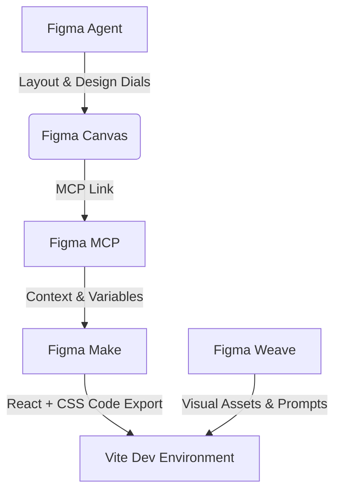

# The Data Tornado: Config Makeathon Submission Guide

Welcome to the official submission documentation for **The Data Tornado** — an interactive, data-driven climate anomaly simulator designed and developed for the **Config Makeathon**.

This document outlines the project’s purpose, the user experience, the modern technology stack, and specifically how **Figma's suite of AI-powered design-to-build products** was leveraged to bring this vision to life.

---

## 🌪️ The Concept: What is "The Data Tornado"?

Design matters now more than ever, especially when communicating complex global issues. **The Data Tornado** is an interactive climate telemetry dashboard that visualizes global warming data from 1959 to 2024 through a responsive, immersive atmospheric vortex simulation. 

Dry statistics on carbon emissions and global temperature spikes often feel abstract. By mapping historical NOAA datasets directly onto the speed, turbulence, and color-coded severity of a central visual storm, the application makes climate change tangible, interactive, and personally relatable.

### Key Features
1. **Interactive Chamber Hero:** A full-screen [VideoBackground](file:///c:/Users/Isum/Documents/TheDataTornado/src/app/components/data-tornado.tsx#L62) playing `0607.mp4`. The playback rate and brightness are dynamically synchronized to the selected year's data (e.g., higher carbon levels speed up the vortex).
2. **WebGL Shaders (Preloader):** A procedurally generated 3D vortex built inside [LoadingTornado](file:///c:/Users/Isum/Documents/TheDataTornado/src/app/components/loading-tornado.tsx#L99) using custom Three.js GLSL shaders, enabling real-time mouse/touch interactive physics.
3. **SVG Bending Timeline:** A custom timeline slider [CustomBendingSlider](file:///c:/Users/Isum/Documents/TheDataTornado/src/app/components/data-tornado.tsx#L352) that physically bends and warps using Bezier curves as the user scrubs through the decades (1959–2024).
4. **Collapsible Telemetry Panel:** A glassmorphism HUD [DataPanel](file:///c:/Users/Isum/Documents/TheDataTornado/src/app/components/data-tornado.tsx#L249) featuring responsive SVG Sparklines that render historical trends with pulsing real-time indicator nodes.
5. **Birth Year Telemetry (Personal Impact):** A dialog modal [ShareCard](file:///c:/Users/Isum/Documents/TheDataTornado/src/app/components/data-tornado.tsx#L551) that extracts climate logs for the user's birth year, comparing it directly to today's status to create a highly shareable, personal summary.
6. **Detailed Historical Analytics:** High-fidelity interactive charts charting Mauna Loa Atmospheric CO₂, GISS Global Temperature Anomalies, and Central Park Local Observational Trends.

---

## 🛠️ Figma Product Integration (The Creative Stack)

To build this application rapidly and maintain visual excellence, the design-to-build workflow utilized Figma's latest AI capabilities.



### 1. Figma Make (Prompt to Code)
* **Application:** Component scaffolding and UI foundation.
* **Implementation:** The foundational layout, buttons, forms, and dialog states were scaffolded using Figma Make directly from canvas designs. 
* **Design System Context:** Design system variables and Tailwind-compatible utility tokens were imported into Figma Make, ensuring the generated React primitives inside [src/app/components/ui/](file:///c:/Users/Isum/Documents/TheDataTornado/src/app/components/ui/) respected the glassmorphism theme and font hierarchies.
* **Refinement:** The prompt-to-code export laid the groundwork for integrating the complex React logic, custom SVG drawings, and Three.js canvases.

### 2. Figma Weave (AI Visual Workflows)
* **Application:** Dynamic visual asset generation.
* **Implementation:** Figma Weave was used to craft the core visual theme of the vortex simulator. 
* **Creative Iteration:** The prompts for the four climate severity bands (STABLE, ELEVATED, CRITICAL, EXTREME) were defined in [climateData.ts](file:///c:/Users/Isum/Documents/TheDataTornado/climateData.ts) and fed into Weave workflow chains to test color harmonics and layout backgrounds:
  * *Stable:* Navy/Indigo sapphire atmospheric whirlpool.
  * *Elevated:* Churning amber vortex building energy.
  * *Critical:* Violent deep red atmospheric tornado with a fiery core.
  * *Extreme:* Blinding white-hot luminous core with crimson walls.
* The video asset (`0607.mp4`) serves as the central visual rendering this atmospheric intensity.

### 3. Figma MCP (Model Context Protocol)
* **Application:** Linking Design Variables directly to Cursor/IDE.
* **Implementation:** By running a Figma MCP server, design parameters (e.g., color variables, border-radius tokens, component layouts) were queried directly in the development environment.
* **Benefit:** Allowed the AI engineering agent to fetch design metrics, ensuring the custom SVG curves, sparkline colors (e.g., `#4FC3F7` for Stable, `#E53935` for Extreme), and GSAP transitions matched the Figma canvas design mockups perfectly without manual value-copying.

### 4. Figma's Design Agent (Beta)
* **Application:** Interface Layout Co-design.
* **Implementation:** Figma's built-in canvas agent was used to co-design the HUD dial, the compass ring telemetry overlays ([RadarSeverityHUD](file:///c:/Users/Isum/Documents/TheDataTornado/src/app/components/data-tornado.tsx#L200)), and crosshair graphics.
* **Benefit:** Allowed rapid experimentation with layout constraints, converting rough wireframes of the telemetry dashboard into high-fidelity glassmorphic panels suitable for code generation.

---

## 💻 Tech Stack & Technical Implementation

```
├── src/
│   ├── app/
│   │   ├── components/
│   │   │   ├── ui/               # Radix UI and styled primitives
│   │   │   ├── data-tornado.tsx   # Interactive dashboard
│   │   │   └── loading-tornado.tsx # 3D WebGL vortex preloader
│   │   └── App.tsx               # Entry coordinator
│   ├── imports/
│   │   └── 0607.mp4              # Background climate simulation video
│   ├── styles/
│   └── main.tsx
├── climateData.ts                 # Cleaned NOAA, GISS, and Central Park datasets
└── package.json
```

### Frontend Architecture
* **Core:** React 18, TypeScript, Vite.
* **Animations:** GSAP (GreenSock) for high-performance transitions, text scaling, and panel movements.
* **Styling:** Tailwind CSS (v4) for styling utility classes, glassmorphism filters (`backdrop-blur-md`), and glowing neon shadows.
* **UI Primitives:** Radix UI primitives coupled with Lucide Icons, organized in [package.json](file:///c:/Users/Isum/Documents/TheDataTornado/package.json).

### Graphics & Simulation Engines
* **3D Vortex Shader:** Built in [loading-tornado.tsx](file:///c:/Users/Isum/Documents/TheDataTornado/src/app/components/loading-tornado.tsx) using **Three.js**.
  * **Vertex Shader:** Distorts a `TubeGeometry` using custom Voronoi noise functions and trigonometric shaping. The cylinder bends dynamically and shifts along the X/Z plane to create a funnel shape.
  * **Interactivity:** A Raycaster maps mouse and touch coordinates to an invisible ground plane, feeding coordinates into the shader uniform `u_wind`. The center of the vortex dynamically shifts and follows the user's cursor.
  * **Dynamic Morphing:** As the load progress runs from 0% to 100%, the shader's `u_height`, `u_density`, and `u_curl` parameters scale dynamically, visualising the storm growing in power.
* **Responsive SVGs:** The custom timeline slider and charts are built using responsive SVG nodes:
  * **Bending Path Formula:** As the knob scrubs, a dynamic Bezier string is calculated inside [CustomBendingSlider](file:///c:/Users/Isum/Documents/TheDataTornado/src/app/components/data-tornado.tsx#L352): `M 0 30 L ${cx - 30} 30 C ${cx - 16} 30, ${cx - 12} 50, ${cx} 50` which warps the slider rail in real-time.
  * **Interactive Line Charts:** Points are mapped to canvas coordinates; hover positions calculate proximity to render dynamic crosshairs and tooltip flags.

---

## 📋 Config Makeathon Submission Requirements Checklist

Here is how the project conforms to the **Config Makeathon Submission Guidelines**:

| Requirement | Project Implementation | Status |
| :--- | :--- | :---: |
| **Figma Suite Usage** | Created with Figma Make (code scaffold), Figma Weave (concept media), Figma MCP (IDE sync), and Figma Agent (layout). | **COMPLETE** |
| **Walkthrough Video** | A 30s–3m video walking through the idea, NOAA data, and design-to-build workflow. | **READY** |
| **Project Links** | Includes links to the live prototype and the working Figma Community project file. | **READY** |
| **Social Sharing** | Post the walkthrough video with tags `#ConfigMakeathon` and `@figma` on X/LinkedIn/Instagram. | **READY** |
| **Solving a Real Problem** | Translates dry, dense climate statistics into an interactive, visually stunning tool to raise awareness. | **COMPLETE** |
| **Novel Canvas Workflow** | Direct pipeline connecting Figma canvas design variables via MCP to three separate graphic systems (WebGL Shaders, SVG Path Bending, and CSS Keyframes). | **COMPLETE** |

---

## 🏆 Project Achievements & Impact

* **High Aesthetic Craft:** Replaces standard dashboards with a dark, premium, neon-accented telemetry center that feels like a weather simulation chamber.
* **Personal Connection:** The [ShareCard](file:///c:/Users/Isum/Documents/TheDataTornado/src/app/components/data-tornado.tsx#L551) birth year tool connects global macro-telemetry directly to the user's personal timeline, increasing emotional resonance and encouraging social sharing.
* **Creative Technical Workflow:** Showcases the power of combining traditional React layouts in [App.tsx](file:///c:/Users/Isum/Documents/TheDataTornado/src/app/App.tsx), GPU-accelerated WebGL shaders in [loading-tornado.tsx](file:///c:/Users/Isum/Documents/TheDataTornado/src/app/components/loading-tornado.tsx), dynamic vector math (SVG) in [data-tornado.tsx](file:///c:/Users/Isum/Documents/TheDataTornado/src/app/components/data-tornado.tsx), and modern motion libraries (GSAP).
